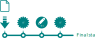

# Easy network to start with PowSyBl

In this user story, the network is quite simple and made of two lines in parallel, with on left side a generator and on right side a load. The load consumes 600 MW and the generator produces 606.5 MW. A load flow computes the flows on the two lines. The flow on the upper line is of 302.4 MW at its entrance and of 300.4 MW at its exit. The flow in the lower line is the same. The power losses are of 2 MW on each line.   

{: width="50%" .center-image}


In this tutorial, we apply a contingency: the upper line is disconnected. A new load flow computes the flow on the lower line: it is now of 610.6 MW at its entrance and of 601 MW at its exit. The rest of the difference between load and generation represents the losses during the voltage transformation process.

{: width="50%" .center-image}

# Workflow

The tutorial can be translated in a short and easy workflow. All the input data are stored in a XIIDM file. This file is imported with the IIDM gateway. Then, a load flow simulator is launched to get flows on all nodes. In this tutorial, the simulator is Hades2 but could be an other load flow simulator, as the API interface contract is respected. A contingency is created and finally, the flows are computed again in order to get the final state.  

{: width="50%" .center-image}

# Identification of the power system blocks

<p>

The network is modeled in IIDM format. This network model can be serialized in a XML format: in this user story, this specific format is called XIIDM.
</p>

````
File file = new File(LoadflowTutorial.class.getResource("/eurostag-tutorial1-lf.xml").getPath());
````

<p>

The input file is imported with a gateway that transforms an XIIDM file in an IIDM memory object.
</p>

````
Network network = Importers.loadNetwork(file.toString());
````

<p>

Flows are computed with a load flow simulator. In this tutorial, we choose to use Hades2.   
</p>
````
// This line defined the way we want to compute : locally by default.
ComputationManager computationManager = LocalComputationManager.getDefault();
// This line configures the load flow computation : with the simulator Hades2 and with the computation manager defined before.
LoadFlow loadflow = new Hades2Factory().create(network, computationManager, 0);

// These are the parameters of the load flow. Here angles are set to zero and tensions are set to one per unit.
LoadFlowParameters loadflowParameters = new LoadFlowParameters()
        .setVoltageInitMode(LoadFlowParameters.VoltageInitMode.UNIFORM_VALUES);
````
Note that we need to create a variant in order to store the computed flows. A variant gathers the variables of a network: injections, productions, etc.

````
LoadFlowResult result = loadflow.run("loadflowVariant", loadflowParameters).join();
````

<p>

</p>

<p>

</p>
